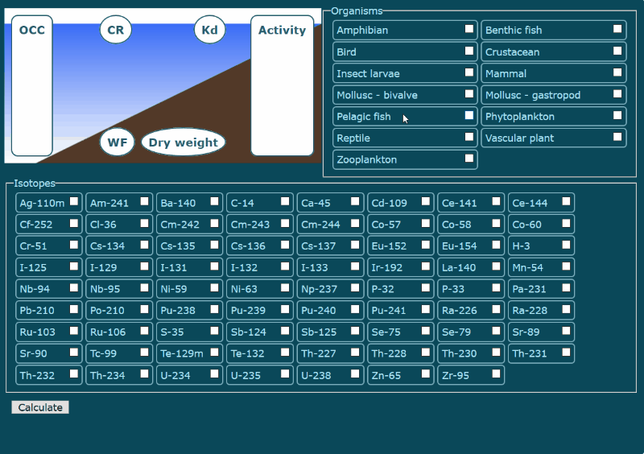

# HYDRA

**v1.0.0** 

**HYdrobionts Dose Rate Assessment** allows to calculate dose rate for aquatic organisms.

HYDRA uses data files of [ERICA Assessment Tool](http://erica-tool.com/) (version 1.3.1.33).

## When to use HYDRA

[ERICA](http://erica-tool.com/) is great tool, which allows to perform dose rate calculations even for non-dosimetrists. It has clear step-by-step interface and appropriate defaults.

But step-by-step interface may not be the most convenient in some cases. For example, you want to fix typo in inputted values or want to change isotopes and/or organisms lists or activity concentrations to try different variants. In such cases HYDRA allows you to go through "change settings -> get result" cycle faster. (The latest version of ERICA can use spatial and temporal series of data, which can be used to try variants.)

Also, if all you need is some dose rates and you don't want to involve any stakeholders or make decisions, HYDRA will give you result faster.

## When not to use HYDRA

In all other cases:)

- HYDRA works only for freshwater ecosystems. If you need marine or terrestrial ecosystems, you should use ERICA.

- HYDRA uses ERICA's dose conversion coefficients and not allow you to change them. *(Actually, you can do this using browser console.)*

- HYDRA can't create new organisms and uses standard ERICA's list. If you want to define new geometry, use ERICA.

- HYDRA outputs only total dose rate from each isotope. *(Internal and external dose rates can be accessed through console.)*

- HYDRA doesn't support data import/export. If you need these features, use ERICA.

## How to use HYDRA

1. Add organisms and isotopes to setup.

2. Enter parameters:

    - Specific activities of isotopes - **Activity** block. For each isotope activity concentration either in water or in sediment must be set. HYDRA will calculate other values using ERICA's coefficients.

    - Organisms occupancy factors - **OCC** block.

    - Concentration ratios - **CR** block.

    - Distribution coefficients - **Kd** block.

    - Radiation weighting factors - **WF** block.

    - Percentage dry weight for sediment - **Dry weight** block.

    For missing data HYDRA will use ERICA's database values.

3. Push **Calculate** button.

4. Get results at the bottom of the page. Total dose rate for each organism and each isotope will be shown.

